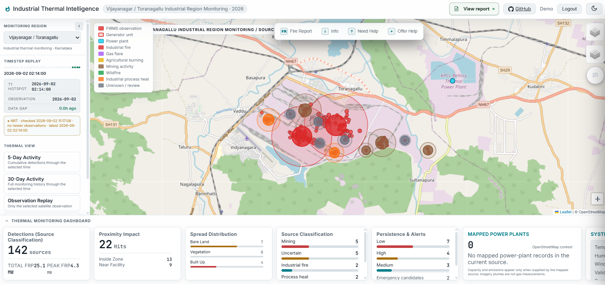
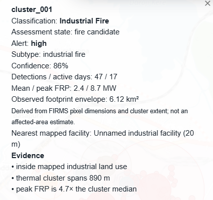
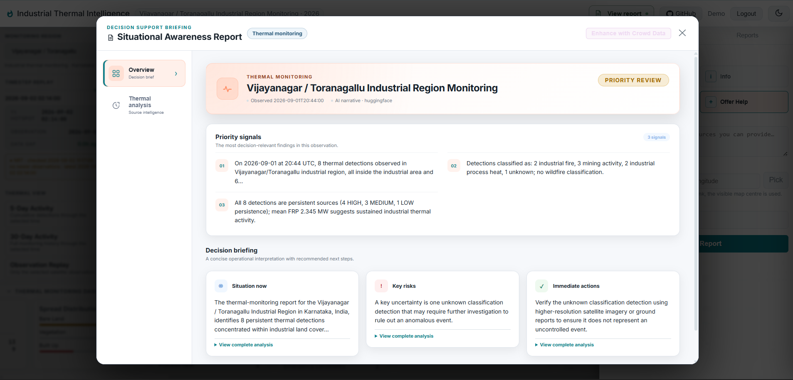
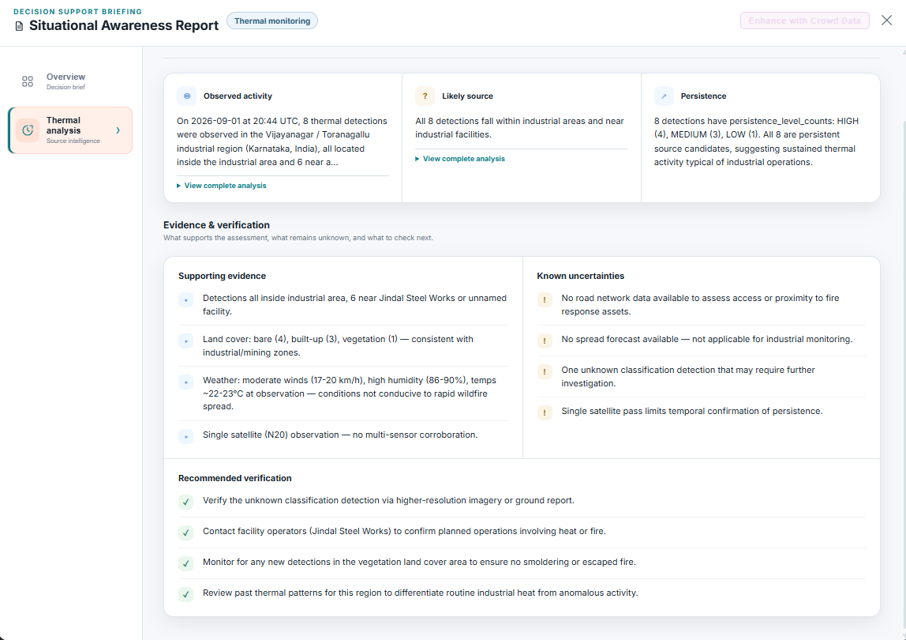

# AI Geospatial Thermal-Source Decision Support

An India-first geospatial monitoring platform that enriches NASA FIRMS thermal
anomalies with land cover, industrial infrastructure and temporal recurrence.
Its explainable source-classification baseline distinguishes industrial-fire
candidates, gas flares, agricultural burning, mining activity, wildfires,
normal industrial process heat and uncertain detections.

The repository also retains its original wildfire spread, evacuation and crowd
intelligence workflow for the Fort McMurray 2016 replay.

**Live demo:** https://wildfire-ai.com/demo

---

## Screenshots

### Main Map View
Real-time fire perimeter, ML-predicted risk zones, hotspots, evacuation road status, and situation dashboard.



### Crowd Field Report
Public field reports submitted during the event, with comments and Google Maps integration.



### AI Situational Awareness Report — Overview
Structured executive briefing generated by 4 specialist AI agents: risk level, stat tiles, situation / key risks / immediate actions.



### AI Report — Crowd Intelligence Tab
AI-synthesized crowd intelligence: urgent help requests, fire observations, and situational patterns extracted from field reports.



---

## Features

### India Thermal-Source Monitoring

- Six industrial corridors and four forest landscapes
- Historical and near-real-time VIIRS FIRMS ingestion
- Multi-sensor deduplication and spatial-temporal source tracking
- ESA WorldCover cropland, forest, built-up and bare-land context
- OpenStreetMap industrial, oil/gas, power and mining infrastructure context
- Separate persistent-source and short-lived thermal-episode analysis
- Explainable seven-way rules-v2 classification with confidence and evidence
- GeoJSON APIs and Leaflet overlays for 5-day, 30-day, persistence and classification views
- Automatic four-hour region-scoped FIRMS refresh with dashboard freshness polling

The classifier is an auditable hackathon baseline, not a validated trained
model. See [SIH implementation and evaluation plan](docs/SIH_IMPLEMENTATION.md).

### Fire Spread Prediction
- Logistic Regression ML model trained on VIIRS FIRMS hotspot + ERA5 weather data
- Predicts fire perimeter at +3h / +6h / +12h horizons
- Wind-driven analytical model as an alternative projection
- Crowd-augmented prediction: field reports inject additional hotspot anchors

### AI Agent Pipeline
Four specialist agents each return structured JSON:

| Agent | Output |
|---|---|
| **Risk Agent** | Fire behaviour, growth trajectory, weather drivers, risk factors |
| **Impact Agent** | Population at risk, affected communities, worsening factors |
| **Evacuation Agent** | Primary + alternative routes with waypoints, road warnings |
| **Crowd Agent** | Urgent help requests, fire observations, situational patterns |
| **Summary Agent** | Risk level, key points, situation / key risks / immediate actions |

Reports are cached in `AI_report/` per timestep and invalidated when crowd data changes.

### Crowd Intelligence
- Citizens submit field reports (fire sighting, road info, help requests)
- AI field report simulator generates GIS-informed synthetic reports for testing
- Reports are anchored to real perimeter, road, and landmark coordinates
- Crowd hotspots are injected into the ML prediction pipeline

### Replay Timeline
- Step through historical wildfire timesteps (Fort McMurray 2016)
- Virtual clock synchronises crowd report timestamps with replay position
- Satellite imagery (Sentinel-2) and weather data update per timestep

### Streaming Chat
- Stateless AI assistant with full event context
- Suggested questions generated from structured report fields

---

## Architecture

```
Frontend (Vanilla JS + Leaflet)
    │
    ▼
Flask REST API  ──────────────────────────────────────────────────────────────
    │                                                                         │
    ├── /api/events          Fire event list + replay clock                   │
    ├── /api/events/:id/timesteps/:ts_id                                      │
    │       ├── /perimeter   ?crowd=true → crowd-augmented                    │
    │       ├── /hotspots                                                     │
    │       ├── /risk-zones                                                   │
    │       ├── /roads       Evacuation status overlay                        │
    │       ├── /population  At-risk population counts                        │
    │       ├── /report      AI analysis (cached in AI_report/)               │
    │       └── /chat        Streaming Claude/Gemini response                 │
    │                                                                         │
    └── /api/events/:id/field-reports   Crowd intelligence CRUD               │
                                                                              │
Pipeline (background thread)                                                  │
    ├── ERA5 weather download → forecast.json + wind_field.json               │
    ├── FIRMS hotspot fetch + crowd hotspot augmentation                      │
    ├── ML inference (Logistic Regression) → perimeter + risk zones (GeoJSON)             │
    └── Spatial analysis → road status + population counts                    │
                                                                              │
AI Agents (on-demand)                                                         │
    Risk → Impact → Evacuation → [Crowd] → Summary → AI_report/*.json ────────
```

---

## Tech Stack

| Layer | Technology |
|---|---|
| Backend | Python 3.11, Flask, SQLAlchemy, PostgreSQL + PostGIS |
| ML / Spatial | Logistic Regression, scikit-learn, GeoPandas, Rasterio, Shapely |
| Weather | ERA5 via CDS API, VIIRS FIRMS |
| AI | Anthropic Claude API (configurable to Gemini) |
| Frontend | Vanilla JS, Leaflet.js, CSS custom properties |
| Auth | JWT access/refresh tokens (PyJWT), bcrypt |

---

## Getting Started

### Prerequisites
- Python 3.11+
- PostgreSQL with PostGIS extension
- Anthropic API key (or Google Gemini API key)
- ERA5 CDS API credentials

### Installation

```bash
git clone https://github.com/geo-raypan/wildfire-decision-support.git
cd wildfire-decision-support

pip install -r requirements.txt
```

### Configuration

Copy `.env.example` to `.env` and fill in:

```env
DB_HOST=localhost
DB_NAME=wildfire_db
DB_USER=postgres
DB_PASSWORD=your-database-password
ANTHROPIC_API_KEY=sk-ant-...
JWT_SECRET_KEY=your-long-random-jwt-secret
JWT_ACCESS_TOKEN_MINUTES=15
JWT_REFRESH_TOKEN_DAYS=30
ADMIN_USERNAME=admin
ADMIN_PASSWORD=change-me-before-first-start
```

### Run

```bash
cd backend
python main.py
```

The server starts on `http://localhost:5000`. The admin account is seeded from
`ADMIN_USERNAME` and `ADMIN_PASSWORD` on first startup.

When `FIRMS_API_KEY` and `THERMAL_AUTO_REFRESH=1` are configured, the backend
starts a near-real-time refresh after initial preparation and repeats it every
`THERMAL_REFRESH_INTERVAL_HOURS` (four hours by default). Each successful cycle
archives new daily observations, rebuilds enrichment/persistence/classification
artifacts and advances the monitoring timeline. The browser checks lightweight
refresh metadata every five minutes and reloads map layers only when the latest
satellite observation changes.

---

## Data

The public catalog contains ten Indian thermal-monitoring regions. The
**Fort McMurray 2016 wildfire** remains available as the legacy spread-prediction
demonstration.

Pre-processed data (ERA5, FIRMS, fuel type rasters, ML model weights) is stored under `data/events/2016_0001/` and is not included in this repository due to size. The pipeline will attempt to download and process it on first run if CDS API credentials are configured.

---

## Project Structure

See [PROJECT_STRUCTURE.md](PROJECT_STRUCTURE.md) for a detailed breakdown of every module.

---

## API Reference

Full OpenAPI 3.0 specification: [docs/api.yaml](docs/api.yaml)

Key endpoint groups:
- `POST /auth/register` — create a credential account
- `POST /auth/login` — receive access and refresh tokens
- `POST /auth/refresh` — rotate a refresh token and receive a new token pair
- `POST /auth/logout` — revoke the current refresh-token family
- `GET /auth/me` — return the authenticated user
- `GET /api/events` — list fire events
- `GET /api/events/:id/timesteps/:ts_id/report` — generate AI situational report
- `POST /api/events/:id/field-reports` — submit crowd field report
- `POST /api/events/:id/field-reports/simulate` — AI-generate synthetic field reports
- `GET /api/events/:id/timesteps/:ts_id/chat` (SSE) — streaming AI chat
